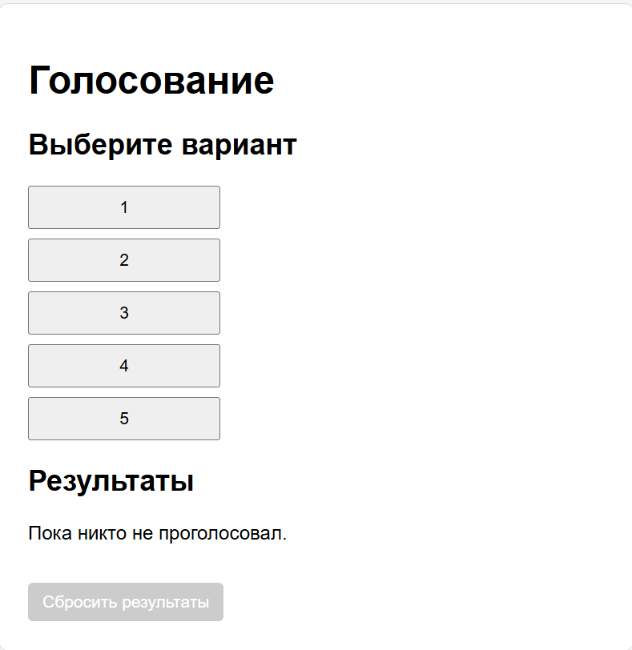
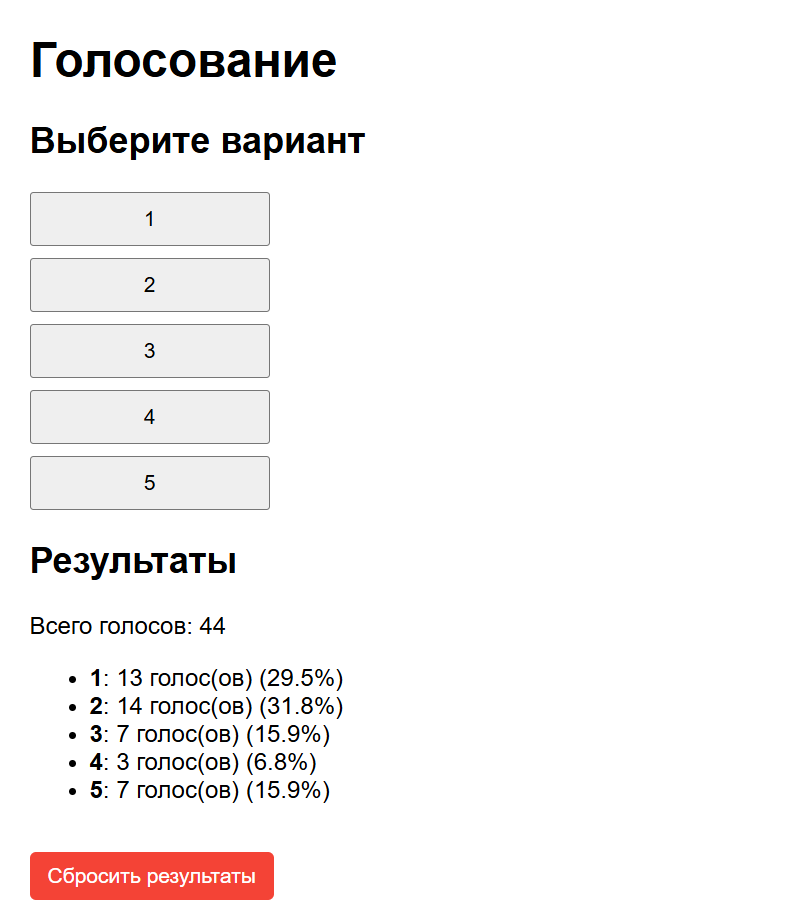

# Карта проекта «Голосование»

## 1. Общая идея
- Одностраничное веб‑приложение для голосования по шкале от 1 до 5.
- Реализовано на чистом HTML + React (через CDN), без сборщиков.

## 2. Структура проекта
- `s.html` — основная страница приложения:
  - Подключение React и ReactDOM через CDN.
  - Вёрстка контейнера и корневого элемента `#root`.
  - Встроенный JavaScript с логикой приложения.

- `readme.md` — документация проекта:
  - Описание назначения.
  - Карта проекта и структура файлов.
  - Инструкция по запуску.

## 3. Основные компоненты (внутри `s.html`)
- `useLocalStorage` — хук для сохранения голосов в `localStorage`.
- `OptionList` — список кнопок с вариантами голосования (1–5).
- `ResultList` — отображение результатов голосования и процентов.
- `ResetButton` — кнопка сброса результатов.
- `App` — корневой компонент, собирающий все части и управляющий состоянием голосов.

## 4. Логика работы
- При нажатии на вариант (1–5) увеличивается счётчик голосов для этого варианта.
- Состояние голосов хранится в `localStorage` под ключом `poll-votes`.
- При перезагрузке страницы результаты сохраняются.
- Кнопка «Сбросить результаты» обнуляет все голоса.

## 5. Запуск проекта
1. Откройте файл `s.html` в браузере.
2. Убедитесь, что есть доступ к CDN (нужен интернет для загрузки React/ReactDOM).
3. Голосуйте, наблюдайте результаты, при необходимости воспользуйтесь сбросом.

